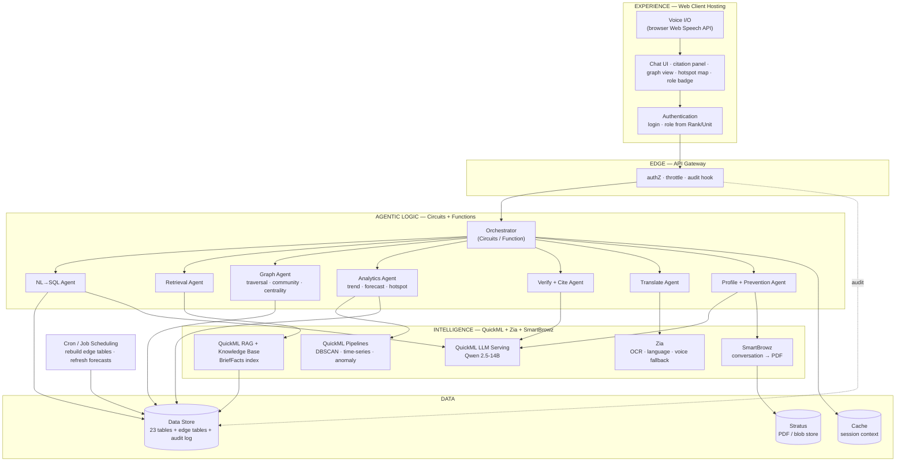
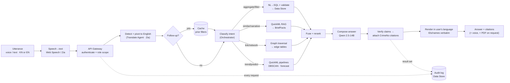
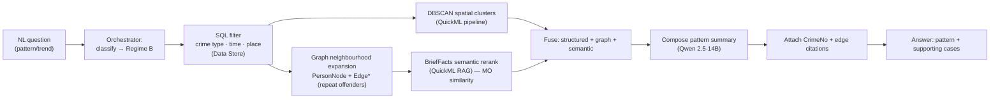
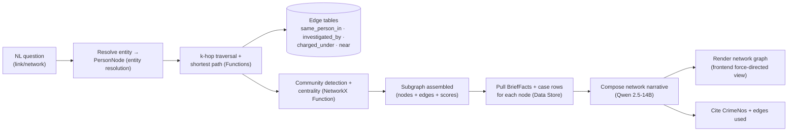
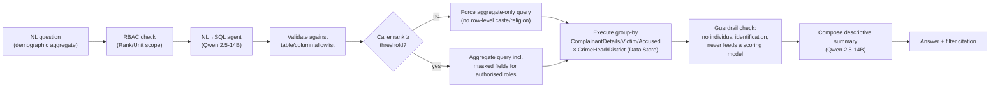
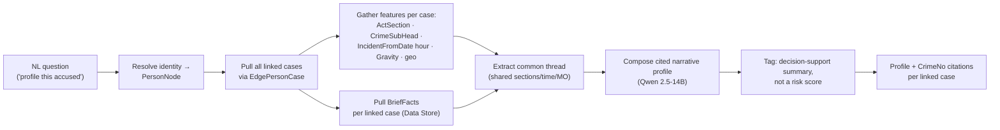
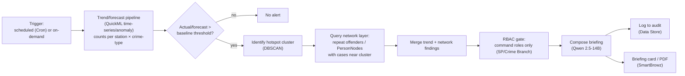

# Execution Plan — KSP Datathon 2026, Challenge 01

**Conversational AI for the Karnataka State Police Crime Database**
Platform: Zoho Catalyst (mandated) · Data: schema provided ([Police_FIR_ER_Diagram.md](Police_FIR_ER_Diagram.md)), rows synthetic

Companion strategy document: [Technical Report](KSP-Datathon2026-Conversational-AI-Technical-Report.html). This plan supersedes the report's §04–§08 architecture wherever the real schema contradicts it.

---

## 1. Revised architecture (schema-grounded)

The provided schema is a fully relational CCTNS-style model: 23 tables centred on `CaseMaster`, with the **only free text in `CaseMaster.BriefFacts`** and geo as `latitude`/`longitude`. There are **no phone, vehicle, address, or bank-account entities, and no cross-case person IDs**. Three consequences drive everything below:

1. **NL→SQL is the primary engine.** "Burglaries in Bengaluru East in the last 6 months" is a structured query, not a RAG question.
2. **Document RAG shrinks to `BriefFacts`** — semantic "find similar cases" over case narratives.
3. **The graph must be *derived*.** With no person master table, hidden links come from entity resolution on names, shared IOs, shared act-sections, and geo proximity.

### 1.0 Architecture & data flow (Catalyst service map)

**Component architecture** — every box is a Zoho Catalyst service; nothing runs off-platform except the browser-side Web Speech API.



**Request data flow** — one question, end to end, with the service handling each step.



**Service inventory (what each is for):**

| Catalyst service | Role in this build |
|---|---|
| Web Client Hosting | Chat UI, graph/map views, PDF download |
| Authentication | Login; role derived from `Rank.Hierarchy` + `Employee.UnitID`/`DistrictID` |
| API Gateway | Zero-trust authZ, throttling, audit hook on every call |
| Circuits / Functions | Orchestration + the agents (NL→SQL, retrieval, graph, analytics, verify, translate, profile/prevention) |
| QuickML LLM Serving | Qwen 2.5-14B — SQL generation, answer composition, profiling |
| QuickML RAG + Knowledge Base | Semantic search over `BriefFacts` with citation breakdown |
| QuickML Pipelines | DBSCAN hotspots, time-series forecast, anomaly early-warning |
| Zia | Language detect/normalise, OCR for legacy scans, voice STT fallback |
| SmartBrowz | Conversation history → PDF |
| Data Store | 23 schema tables + derived edge tables + append-only audit log |
| Cache | Per-session conversation context for follow-ups |
| Stratus | Blob/PDF storage |
| Cron / Job Scheduling | Nightly edge-table rebuild, periodic forecast refresh |

### 1.1 Structured layer (primary)

- All 23 tables loaded into **Catalyst Data Store** exactly as per the ER diagram.
- **Query Agent = NL→SQL**: the prompt to Qwen 2.5-14B (QuickML LLM Serving) contains the schema description plus the *actual lookup values* (CrimeHead/SubHead names, CaseStatus values, district and station names, Act short-names) so the model maps "murder" → `CrimeSubHead.CrimeHeadName='Murder'` and "Bengaluru East" → the right `Unit`/`District` IDs without guessing.
- **Validation layer before execution**: generated SQL is parsed and checked against an allowlist of tables/columns/functions; anything outside it is rejected and re-prompted. SELECT-only, always scoped by the caller's RBAC filter (§1.5). This is the NL→SQL hallucination guard.
- Every structured answer cites the `CrimeNo`s (and aggregate counts cite the filter used), rendered as clickable citations.

### 1.2 Semantic layer (secondary)

- `BriefFacts` chunked **one chunk per case** (narratives are summary-length) into **QuickML Knowledge Base**, each chunk prefixed with metadata: `CrimeNo`, CaseMasterID, district, station, crime head, registered date.
- QuickML RAG handles "what happened in this case" and "find cases similar to this MO"; hits join back to structured rows via CaseMasterID for enrichment and citation.

### 1.3 Relationship layer (derived graph)

Built at ingestion as Data Store tables (Catalyst has no native graph DB — same trade-off the report documents):

| Table | Content |
|---|---|
| `PersonNode` | Accused + complainants resolved across cases: normalised name (lowercase, initials expanded, transliteration-normalised) + age band (±3 yrs) + gender → one person node with member records |
| `EdgePersonCase` | `same_person_in` — person node → every case they appear in, with role (accused/complainant) |
| `EdgeCaseEmployee` | `investigated_by` — case → registering officer / IO (`PolicePersonID`, `ArrestSurrender.IOID`) |
| `EdgeCaseSection` | `charged_under` — case → Act/Section (from `ActSectionAssociation`) |
| `EdgeCaseNear` | `near` — case ↔ case within geo radius (e.g. 500 m) and time window (e.g. 30 days) |

- **Traversal in Catalyst Functions**: k-hop neighbourhood of a person node; shortest path between two cases; "who connects these FIRs".
- **Entity resolution is the linchpin and the biggest accuracy risk** — thresholds tuned on seeded synthetic variants in the data generator. Every resolved link carries a match-confidence surfaced in the answer ("possible same person, name variant").

### 1.4 Query routing — two retrieval regimes

The orchestrator classifies intent and routes to one of two regimes. This is the core design decision: **GraphRAG is reserved for pattern discovery and network analysis; everyday NL crime-data querying uses NL→SQL + traditional RAG.**

**Regime A — NL crime-data querying (NL→SQL + traditional RAG).** The conversational Q&A surface. Two modes under one chat:
- *Aggregate / filter / exact-fact* → **NL→SQL** over Data Store (§1.1). Handles "how many", date ranges, station/district filters, joins — the things retrieval cannot count or filter reliably.
- *Semantic / narrative / "find similar"* → **traditional RAG** over `BriefFacts` (§1.2): embed → retrieve top-k → compose with citations.
- Mixed questions run both and merge (structured rows + narrative context), citing CrimeNos.

**Regime B — GraphRAG (pattern discovery + criminal network analysis, §1.7).** For link/pattern/network questions the pipeline fuses the graph in:

```
structured filter (SQL) → graph neighbourhood expansion (edge tables §1.3)
→ BriefFacts semantic rerank (traditional RAG) → compose (Qwen)
→ answer citing CrimeNos + the specific edges used
```

The distinction: Regime A retrieves *documents/rows* to answer a question; Regime B additionally traverses *relationships* to surface connections no single row states. Routing is one branching Function — Circuits adopted only if a Catalyst capability spike shows it beats a plain Function (ponytail: one Function that branches may be all we need).

### 1.5 RBAC, masking, audit (mapped to real tables)

- Roles come from the schema itself: `Rank.Hierarchy` + `Employee.UnitID`/`DistrictID`. Demo logins are rows in `Employee`.
  - **Constable**: cases of own station (`Unit`) only; caste/religion columns masked.
  - **Inspector/IO**: own district, full person detail, graph access.
  - **SP**: district-wide aggregates and trends.
- Masking of DPDP-sensitive fields (`CasteID`, `ReligionID` on complainants) enforced in the serving Function, not the UI.
- **Audit**: every query → append-only Data Store table (who, role, question, generated SQL, CrimeNos returned, timestamp) + a simple viewer page.

### 1.6 Kannada bridge, voice & conversation features

- **Translate–reason–translate**: detect language → pivot to English for NL→SQL and reasoning → render answer back in Kannada, names/CrimeNos preserved verbatim.
- **Voice interaction**: browser-native Web Speech API (`SpeechRecognition`/`SpeechSynthesis`) converts voice↔text at the client; after that it is just another typed message into the same pipeline. Spike Kannada coverage in-browser early; fall back to a Zia/STT service, then to typed-only (cut line).
- **Context-aware conversations**: Catalyst Cache keyed by session, holding the active filters from the last turn (date range, station, crime type, case IDs). The orchestrator reads it before building the next query, so "now just the two-wheelers" narrows the previous result.
- **PDF export of conversation history**: transcript + citations already exist in Cache/audit; a SmartBrowz Function renders them to PDF on request. No new data path.

### 1.7 Analytics & prediction layer

All of these are Functions/pipelines over tables already being built — no new services.

| Capability | Implementation |
|---|---|
| **Crime pattern discovery** (GraphRAG, Regime B) | GraphRAG fusion: structured filter → graph expansion over shared persons/sections/geo → `BriefFacts` semantic rerank → composed pattern with citations. Complemented by DBSCAN spatial clusters; repeat patterns fall out of the entity-resolution graph. |
| **Trend detection** | Group-by roll-ups over `CrimeRegisteredDate` × `CrimeSubHeadID` × `PoliceStationID`; QuickML time-series for smoothing/seasonality. |
| **Hotspot map** | DBSCAN clusters rendered on a map view in the UI. |
| **Predictive analytics & early warnings** | QuickML time-series/anomaly forecast of next-period case counts per station × crime type; alert when actual or forecast crosses threshold vs. historical baseline. **Geographic/temporal only — never a per-person risk score.** |
| **Criminal network analysis** (GraphRAG, Regime B) | Graph traversal (k-hop, path) **plus community detection and centrality**, run as a Function (NetworkX or equivalent) over a snapshot of the edge tables — surfaces rings and brokers; GraphRAG composes the finding into a cited narrative. |
| **Network visualization** | Function returns the subgraph for a person/case; frontend renders with a lightweight force-directed component. |
| **Socio-demographic insights** | NL→SQL aggregates over `ComplainantDetails`/`Victim`/`Accused` demographics (age, gender, occupation; religion/caste only as aggregates to analyst/SP roles). **Guardrail: caste/religion are never features in any predictive or scoring model.** |
| **Behavioral profiling** | Per `PersonNode`: assemble all linked cases (sections, times, geo, `BriefFacts`), Qwen composes a cited narrative profile — "common thread" summary, not a black-box score. |
| **Proactive prevention intelligence** | Synthesis briefing for command roles: rising-trend hotspots joined with active repeat offenders nearby ("burglaries in this cluster 40% above baseline; 2 repeat offenders with cases in range"). Decision-support only, fully logged, never an automated trigger. |

### 1.8 Capability data-flow diagrams

Each of the five analytics capabilities has its own pipeline. All read from the same Data Store tables and edge tables (§1.1, §1.3) — only the routing differs.

**Crime pattern discovery** (GraphRAG, Regime B)



**Criminal network analysis** (GraphRAG, Regime B)



**Socio-demographic insights**



**Behavioral profiling**



**Proactive crime prevention intelligence**



---

## 2. Scope & cut lines

**Committed (must demo):**

*Core conversational platform*
1. NL question → cited answer (NL→SQL + validation + CrimeNo citations), English + Kannada
2. Voice-enabled interaction (Web Speech API over the same pipeline)
3. Context-aware multi-turn conversations (Catalyst Cache session state)
4. PDF export of conversation history (SmartBrowz)
5. Explainable answers + immutable audit trail
6. RBAC by rank (Catalyst Auth + `Rank`/`Unit` scoping, DPDP field masking)

*Analytics & intelligence (§1.7)*
7. Crime pattern discovery (SQL aggregates + MO similarity + DBSCAN clusters)
8. Criminal network analysis + visualization (traversal, community detection, centrality; GraphRAG fusion for link questions)
9. Hidden-link discovery (entity-resolution graph)
10. Crime trend & hotspot detection (roll-ups + DBSCAN map)
11. Predictive analytics & early warnings (station × crime-type forecasts, threshold alerts — geographic only)
12. Socio-demographic insights (demographic aggregates, guardrailed)
13. Behavioral profiling (cited per-person narrative from linked cases)
14. Proactive prevention briefing (trend + network synthesis for command roles)

**Cut lines (pre-agreed degradations, invoke without debate if a feature is at risk of not being demo-ready):**
| Feature at risk | Degrade to |
|---|---|
| Voice input | Typed Kannada only |
| Fuzzy entity resolution | Exact normalised-name match (synthetic data guarantees matches) |
| GraphRAG fusion into one answer | Graph panel rendered *alongside* the RAG answer |
| Community detection / centrality | k-hop traversal + path-finding only |
| Predictive forecasts | Descriptive trend charts (actuals vs. baseline, no forecast) |
| Prevention briefing | Two separate views (hotspot map + repeat-offender list) instead of one synthesis |
| Behavioral profile | Raw linked-case list without the composed narrative |
| PDF export | Print-to-PDF from the browser |

---

## 3. Risk register

| Risk | Likelihood | Trigger | Mitigation / fallback |
|---|---|---|---|
| ZCQL can't express needed joins/aggregates | Med | Early Catalyst capability check | Precomputed denormalised views at ingestion; Functions-side join composition |
| NL→SQL hallucinates columns/values | High | Eval failures | Allowlist validation + re-prompt; lookup values in prompt; SELECT-only |
| Entity-resolution false positives | Med | Wrong links in rehearsal | Curated seeds guarantee true positives; confidence shown on every link; cut line → exact match |
| Qwen Kannada generation weak | High (known) | Kannada answers garbled | English-pivot bridge is the design; names/IDs passed through verbatim |
| QuickML RAG has no chat history | Certain (known) | — | Multi-turn context is app-layer by design: session state in Catalyst Cache (§1.6) |
| QuickML quotas/latency too tight for live demo | Med | Early Catalyst capability check | Cache pre-staged demo queries; trim dataset; recorded backup |
| Demo-day connectivity failure | Low | — | Recorded backup demo (mandatory) |
| Synthetic data looks fake to jury | Med | Q&A | Schema is the *official* one; say so — "runs unchanged on real CCTNS rows" |
| Web Speech API lacks Kannada STT in target browser | Med | Voice spike | Zia/STT service fallback; cut line → typed Kannada |
| Forecasts meaningless on synthetic data | High | Eval | Seed the generator with deliberate trends/seasonality so forecasts have signal; present as capability demo, not validated prediction |
| 14 committed features overload the team | High | Any checkpoint slip | Cut lines above are per-feature and pre-agreed; core platform (items 1–6) always outranks analytics (7–14) |
| Profiling/demographics read as discriminatory | Med | Jury Q&A | Guardrails are in the design (§1.7): no person risk scores, caste/religion never model features, aggregates only — say so proactively |

---

## 4. Demo runbook (8 beats) & metrics

**Beats — every query pre-staged against known synthetic records:**
1. **Kannada voice question, cited answer** — constable login asks *by voice* in Kannada: "ಕಳೆದ 6 ತಿಂಗಳಲ್ಲಿ ಬೆಂಗಳೂರು ಪೂರ್ವದಲ್ಲಿ ಕಳ್ಳತನ ಪ್ರಕರಣಗಳು?" → spoken + written Kannada answer with CrimeNo citations.
2. **Context follow-up** — "ಅದರಲ್ಲಿ ದ್ವಿಚಕ್ರ ವಾಹನ ಕಳ್ಳತನ ಮಾತ್ರ" ("only the two-wheeler ones") → system narrows the previous result using session memory.
3. **RBAC made visible** — switch to Inspector login, same question → richer rows (demographics unmasked, more stations); say the sentence: "same engine, role-scoped."
4. **Hidden link + network** — "Is the accused in FIR X connected to any other cases?" → graph lights up: *Ravi Kumar / Ravi K, 4 FIRs, 3 stations*, with match confidence; zoom out to the community view showing the wider ring and its most-connected node.
5. **Pattern → prediction** — SP login: hotspot map with a cluster trending above baseline → early-warning card → prevention briefing naming the repeat offenders active near it.
6. **Behavioral profile** — click a repeat offender → cited narrative profile: preferred sections, time-of-day, MO summary from `BriefFacts`.
7. **Explainability** — click any citation → the exact CaseMaster row and BriefFacts excerpt.
8. **Audit + export** — open the audit viewer (every query logged), then one click → PDF of the whole conversation.

**Metrics (report §12 trimmed to what 2 weeks can prove, shown as a slide + live eval script):**
- SQL correctness on the 30-question labelled set (target ≥ 85%)
- Hallucination rate: % of answer claims not traceable to a CrimeNo (target ~0 — the headline number)
- Recall@5 for similar-case retrieval on seeded MO pairs
- p95 end-to-end latency (target < 8 s)
- Kannada parity spot-check: 10 paired KN/EN questions, same answers

---

## 5. Definition of done

- All 14 committed features pass in a full run-through **on Catalyst, not localhost** (cut-line degradations count as passing if invoked per §2).
- Recorded backup demo exists.
- Eval numbers computed and on the slide.
- Every table/column referenced in code exists in [Police_FIR_ER_Diagram.md](Police_FIR_ER_Diagram.md) — no invented schema.
