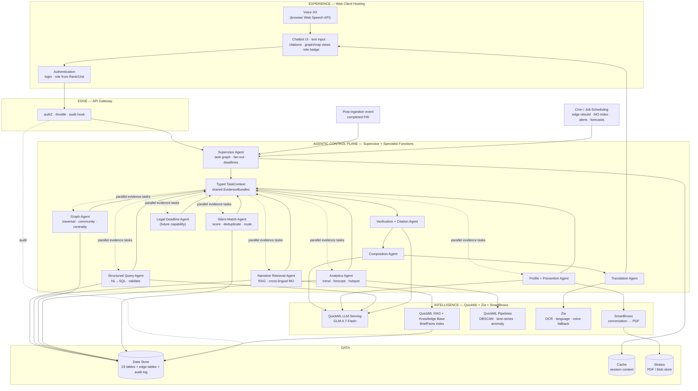
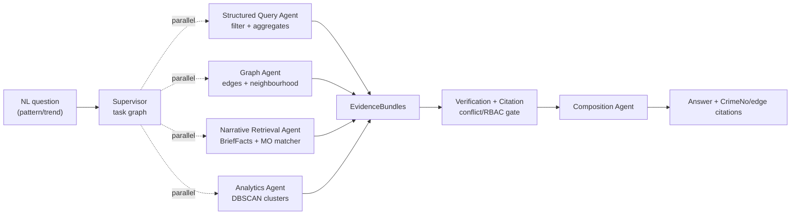
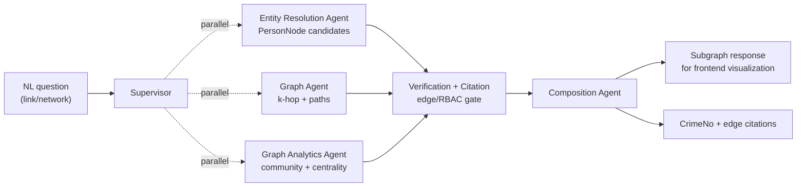
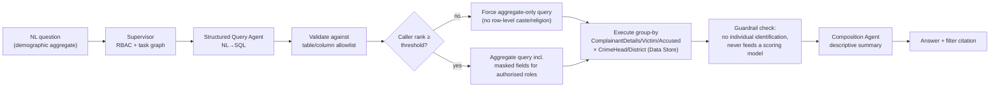
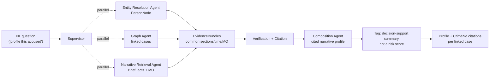
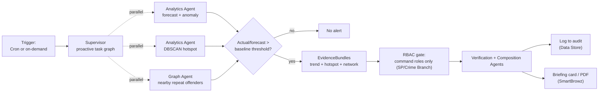

# Execution Plan — KSP Datathon 2026, Challenge 01

**Conversational AI for the Karnataka State Police Crime Database**
Platform: Zoho Catalyst (mandated) · Data: schema provided ([Police_FIR_ER_Diagram.md](Police_FIR_ER_Diagram.md)), rows synthetic

Companion strategy document: [Technical Report](KSP-Datathon2026-Conversational-AI-Technical-Report.html). This plan supersedes the report's §04–§08 architecture wherever the real schema contradicts it.

Current production implementation plans: [Cross-Lingual MO Matching + Silent-Match Alerts](docs/superpowers/plans/2026-07-21-cross-lingual-silent-match-alerts.md) and [Rank-Derived Capability RBAC](docs/superpowers/plans/2026-07-21-rank-derived-capability-rbac.md). Related designs: [cross-lingual semantic MO matching](docs/superpowers/specs/2026-07-21-cross-lingual-semantic-mo-matching-design.md), [cross-jurisdiction silent-match alerts](docs/superpowers/specs/2026-07-18-cross-jurisdiction-silent-match-alerts-design.md), [rank-derived capability RBAC](docs/superpowers/specs/2026-07-21-rank-derived-capability-rbac-design.md), and [provider-neutral voice interaction architecture](docs/superpowers/specs/2026-07-22-voice-interaction-architecture-design.md).

---

## 1. Revised architecture (schema-grounded)

The provided schema is a fully relational CCTNS-style model: 23 tables centred on `CaseMaster`, with the **only free text in `CaseMaster.BriefFacts`** and geo as `latitude`/`longitude`. There are **no phone, vehicle, address, or bank-account entities, and no cross-case person IDs**. Four consequences drive everything below:

1. **NL→SQL is the primary engine.** "Burglaries in Bengaluru East in the last 6 months" is a structured query, not a RAG question.
2. **Document RAG shrinks to `BriefFacts`** — semantic "find similar cases" over case narratives.
3. **The graph must be *derived*.** With no person master table, hidden links come from entity resolution on names, shared IOs, shared act-sections, and geo proximity.
4. **Execution is supervisor-led and multi-agent.** A supervisor decomposes each request or proactive event into typed capability tasks, fans out independent specialists in parallel, merges their evidence, and sends only verified claims to composition.

### 1.0 Architecture & data flow (Catalyst service map)

**Component architecture** — every box is a Zoho Catalyst service; nothing runs off-platform except the browser-side Web Speech API.



**Request data flow** — one question, end to end, with the service handling each step.

```mermaid
flowchart LR
  VOICEQ["Voice query<br/>KN / EN / mixed"] --> STT["Speech→text<br/>Web Speech / Zia"]
  CHATQ["Chatbot text query<br/>KN / EN"] --> INPUT["Final query text"]
  STT --> INPUT
  INPUT --> AUTHZ["API Gateway<br/>authenticate + role scope"]
  AUTHZ --> LANG["Detect + pivot to English<br/>(Translation Agent · Zia)"]
  LANG --> CTX{"Follow-up?"}
  CTX -- yes --> MEM[("Cache<br/>prior filters")]
  CTX -- no --> SUP["Supervisor Agent<br/>classify task + build fan-out"]
  MEM --> SUP
  SUP --> TASKS["Typed TaskContext<br/>caller scope · deadline · citation policy"]
  TASKS -. relevant agents in parallel .-> SQLQ["Structured Query Agent<br/>NL→SQL + validate"]
  TASKS -. relevant agents in parallel .-> RET["Narrative Retrieval Agent<br/>QuickML RAG + MO Matcher"]
  TASKS -. relevant agents in parallel .-> GRP["Graph Agent<br/>edge traversal"]
  TASKS -. relevant agents in parallel .-> ANL["Analytics Agent<br/>DBSCAN · forecast"]
  SQLQ & RET & GRP & ANL --> ENV["EvidenceBundles<br/>claims · citations · confidence · limits"]
  ENV --> VER["Verification + Citation Agent<br/>merge · conflict check · RBAC"]
  VER --> COMP["Composition Agent<br/>GLM-4.7-Flash"]
  COMP --> BACK["Translation Agent<br/>IDs/names verbatim"]
  BACK --> OUT["Answer + citations<br/>(chat + voice, + PDF on request)"]
  AUTHZ -. every request .-> AUD[("Audit log<br/>Data Store")]
  VER -. result set .-> AUD
```



**Service inventory (what each is for):**

| Catalyst service | Role in this build |
|---|---|
| Web Client Hosting | Chatbot text input, speech controls, graph/map views, citations, PDF download |
| Authentication | Login; role derived from `Rank.Hierarchy` + `Employee.UnitID`/`DistrictID` |
| API Gateway | Zero-trust authZ, throttling, audit hook on every call |
| Circuits / Functions | Supervisor, typed task context, specialist agents, retries, and evidence verification |
| QuickML LLM Serving | Catalyst QuickML GLM-4.7-Flash — SQL generation, answer composition, profiling |
| QuickML RAG + Knowledge Base | Semantic search over `BriefFacts` with citation breakdown |
| QuickML Pipelines | DBSCAN hotspots, time-series forecast, anomaly early-warning |
| Zia | Language detect/normalise, OCR for legacy scans, voice STT fallback |
| SmartBrowz | Conversation history → PDF |
| Data Store | 23 schema tables + derived edge tables + MO index + silent-match alerts + append-only audit log |
| Cache | Per-session conversation context for follow-ups |
| Stratus | Blob/PDF storage |
| Cron / Job Scheduling | Edge-table rebuild, MO index refresh, batch alert scans, and forecast refresh |

### 1.0.1 Supervisor contract and typed evidence

The supervisor is the control plane for both conversational requests and
proactive events. It does not answer questions or perform domain scoring. It
creates a request-scoped `TaskContext` containing:

- request/event id, task type, original utterance or anchor case id;
- caller identity, RBAC scope, language state, and citation policy;
- active conversation filters from Cache;
- total deadline, per-agent timeout, retry budget, and selected capabilities.

Relevant specialists run concurrently and return a typed `EvidenceBundle`:

```text
EvidenceBundle {
  agent_name,
  status,
  claims[],
  rows_or_entities[],
  citations[],
  evidence_signals[],
  confidence,
  limitations[],
  index_or_model_version,
  elapsed_ms
}
```

The supervisor merges bundles, detects conflicts, rechecks RBAC, and passes
only accepted claims to the Verification + Citation Agent. Contradictions are
reported in `limitations[]`; they are never silently averaged. The Composition
Agent receives verified claims only, and the Translation Agent renders the
final answer while preserving names and `CrimeNo`s verbatim.

The local execution contract is implemented by
`functions/crime_query/supervisor_runtime.py`: isolated specialists are
bounded by per-agent timeouts and retry budgets, failures are reduced to stable
codes, and composition runs only after the merged evidence envelope. The
SQLite adapter uses inline execution because its connection is thread-bound;
Catalyst deployments should map independent groups to isolated Function or
Circuit invocations for parallel fan-out.

The nine-beat disconnected backup is executable through
`tools/demo_replay.py`; it writes the synthetic, redacted transcript at
`docs/demo-replay.json` and verifies the same application boundaries used by
the live path. `tools/offline_eval.py` writes the labelled synthetic contract
baseline and `docs/evaluation-slide.md`. These artifacts are explicitly
offline evidence and do not close the authenticated Catalyst/QuickML gate.

For proactive work, the same contract is invoked by a post-ingestion Function
or Cron. `SilentMatchAgent` consumes structured, identity, graph, and semantic
bundles, applies the bounded evidence scorer, and writes durable alert state.
Scheduled and post-ingestion invocations resolve through a separate Catalyst
service-principal mapping and a dedicated policy-scope Employee row; they do
not accept a browser `employee_id` or impersonate an officer session. Service
principals are restricted to index, scan, and graph-projection job routes.
The future `Legal Deadline Agent` uses the same contract but is not part of the
current committed feature set until its own spec is approved.

### 1.1 Structured layer (primary)

- All 23 tables loaded into **Catalyst Data Store** exactly as per the ER diagram.
- **Query Agent = NL→SQL**: the prompt to Catalyst QuickML GLM-4.7-Flash contains the schema description plus the *actual lookup values* (CrimeHead/SubHead names, CaseStatus values, district and station names, Act short-names) so the model maps "murder" → `CrimeSubHead.CrimeHeadName='Murder'` and "Bengaluru East" → the right `Unit`/`District` IDs without guessing.
- **Validation layer before execution**: generated SQL is parsed and checked against an allowlist of tables/columns/functions; anything outside it is rejected and re-prompted. SELECT-only, always scoped by the caller's RBAC filter (§1.5). This is the NL→SQL hallucination guard.
- Every structured answer cites the `CrimeNo`s (and aggregate counts cite the filter used), rendered as clickable citations.

### 1.2 Semantic layer (secondary)

- `BriefFacts` chunked **one chunk per case** (narratives are summary-length) into **QuickML Knowledge Base**, each chunk prefixed with metadata: `CrimeNo`, CaseMasterID, district, station, crime head, registered date.
- `Narrative Retrieval Agent` handles "what happened in this case" through QuickML RAG and delegates cross-lingual similar-case retrieval to the provider-neutral `MoMatcher` service.
- `MoMatcher` indexes Kannada, English, and mixed-language `BriefFacts` in one shared embedding space, returns top accessible cases with original sentence excerpts and controlled MO concepts, and records model/index versions.
- `SilentMatchAgent` consumes `mo_similarity` only as bounded evidence (maximum 10 points); semantic similarity alone can never create an alert.
- All hits join back to structured rows via `CaseMasterID` for RBAC, enrichment, and `CrimeNo` citation.

### 1.3 Relationship layer (derived graph)

Built at ingestion as Data Store tables (Catalyst has no native graph DB — same trade-off the report documents):

| Table | Content |
|---|---|
| `PersonNode` | Accused + complainants resolved across cases: normalised name (lowercase, initials expanded, transliteration-normalised) + age band (±3 yrs) + gender → one person node with member records |
| `EdgePersonCase` | `same_person_in` — person node → every case they appear in, with role (accused/complainant) |
| `EdgeCaseEmployee` | `investigated_by` — case → registering officer / IO (`PolicePersonID`, `ArrestSurrender.IOID`) |
| `EdgeCaseSection` | `charged_under` — case → Act/Section (from `ActSectionAssociation`) |
| `EdgeCaseNear` | `near` — case ↔ case within geo radius (e.g. 500 m) and time window (e.g. 30 days) |

- **Traversal in Catalyst Functions**: k-hop neighbourhood of a person node; shortest path between two cases; "who connects these FIRs".
- **Entity resolution is the linchpin and the biggest accuracy risk** — thresholds tuned on seeded synthetic variants in the data generator. Every resolved link carries a match-confidence surfaced in the answer ("possible same person, name variant").

### 1.4 Query routing — supervisor task graphs

The Supervisor Agent classifies the task, selects the smallest relevant set of
specialists, and fans them out concurrently. The old two-regime distinction is
retained as task profiles, not as separate linear pipelines:

**Structured task profile:** `Structured Query Agent` generates and validates
NL→SQL over Data Store for counts, filters, dates, joins, and exact facts.

**Narrative task profile:** `Narrative Retrieval Agent` runs QuickML RAG for
case narratives and `MoMatcher` for cross-lingual similar-case retrieval.

**Relationship task profile:** `Structured Query Agent`, `Graph Agent`, and
`Narrative Retrieval Agent` run in parallel. The graph agent expands derived
edges; the narrative agent reranks `BriefFacts`; the verifier checks the edge
and `CrimeNo` citations together.

**Mixed task profile:** all independent structured, semantic, graph, and
analytics evidence producers run concurrently, then return typed
`EvidenceBundle`s to the verifier. An agent is omitted when its capability is
not required by the task.

**Proactive task profile:** a post-ingestion event or Cron creates a task with
an anchor case or date window. `SilentMatchAgent` combines structured,
identity, graph, and semantic bundles and persists a deduplicated alert. The
same scanner contract supports both live and replayable batch execution.

GraphRAG remains the fusion behavior for link/network questions, but it is
implemented as a supervisor task graph:

```
Supervisor → SQL + graph + BriefFacts/MO agents in parallel
→ typed EvidenceBundles → conflict/RBAC/citation verification
→ composition → answer with CrimeNo + edge citations
```

The supervisor uses Catalyst Function orchestration for short tasks and
Catalyst Circuits for durable fan-out, retries, or long-running work. No agent
can bypass validation, RBAC, or citation verification.

### 1.5 RBAC, masking, audit (mapped to real tables)

Authority comes only from `Rank.Hierarchy`, `Employee.UnitID`, and
`Employee.DistrictID`; no separate role or permissions table is introduced.
Lower `Rank.Hierarchy` means higher authority. The supervisor resolves an
immutable `AccessContext` for every request and proactive event:

```text
AccessContext {
  employee_id, rank_hierarchy, access_bucket,
  unit_ids, district_ids, capabilities[],
  sensitive_data_policy, alert_actions[], audit_visibility
}
```

The rank-derived buckets are:

| Bucket | Scope |
|---|---|
| Constable | Own police station |
| SI/IO | Own district and assigned investigation context |
| Inspector | Own district and district intelligence |
| SP/Command | District-wide command intelligence and approved aggregates |
| DGP/Statewide | Statewide intelligence and cross-district operations |

Capabilities are default-denied and control both specialist dispatch and
resource/action access:

| Capability | Constable | SI/IO | Inspector | SP/Command | DGP/Statewide |
|---|---|---|---|---|---|
| Structured/narrative/similar-case reads | Own station | District | District | District | Statewide |
| Graph/network view | Denied | District | District | District | Statewide |
| Cross-jurisdiction alert visibility | Denied | Visible assigned cases | District | District | Statewide |
| Alert review | Denied | Assigned/visible cases | District | District | Statewide |
| Alert disposition | Denied | Assigned cases | District | District | Statewide |
| Batch scan | Denied | Denied | Denied | Approved district | Approved statewide |
| Live scan | Denied | Own assigned case | District case | District | Statewide |
| Deadline-risk view | Own cases | Assigned cases | District | District | Statewide |
| Conversation export | Own session | Own session | Own session | Own session | Own session |
| Audit view | Own actions | Own actions | District actions | District audit | Statewide summary |

Enforcement occurs at every boundary: API Gateway authentication, supervisor
agent selection, specialist resource loading, EvidenceBundle merge, verifier
citation checks, and response/action serialization. `allowed_units()` and the
existing AST masking policy remain the hard row and sensitive-field boundary;
capabilities decide whether an operation may start.

Use stable policy errors: `CAPABILITY_DENIED`, `SCOPE_DENIED`,
`SENSITIVE_FIELD_DENIED`, and `ACTION_DENIED`. Denials return no case
identifier, `CrimeNo`, name, excerpt, graph node, or alert score and are
append-only audit events. Alert visibility and alert disposition are separate;
`Linked` and `Dismissed` still require a non-empty note. Audit viewers are
themselves limited to own-action, district, or statewide summary scope.

Masking of DPDP-sensitive fields (`CasteID`, `ReligionID` on complainants) is
enforced in the serving Function, not the UI, and is never relaxed by a
capability grant. Caste/religion never enter semantic text, graph features,
alert scoring, summaries, exports, or audit logs.

### 1.6 Chatbot, Kannada bridge, voice & conversation features

- **Translate–reason–translate**: the Translation Agent detects language, pivots to English for specialist reasoning, and renders verified output back in Kannada; names and CrimeNos are preserved verbatim.
- **Chatbot query interface**: the Web Client Hosting experience provides a persistent text composer for English, Kannada, and mixed-language questions. Typed messages enter the same API contract, Supervisor task graph, RBAC filters, evidence verification, citations, session context, and audit trail as voice queries.
- **Voice querying**: browser-native Web Speech API (`SpeechRecognition`/`SpeechSynthesis`) converts voice↔text at the client; the final transcript enters the same query path as a chatbot message. The full contract is defined in the [voice interaction architecture design](docs/superpowers/specs/2026-07-22-voice-interaction-architecture-design.md).
- **Voice turn safety**: the client owns VAD, immediate TTS cancellation, prior-request aborts, and monotonic `turn_id` handling. Only final transcripts enter Catalyst; stale responses are discarded and never rendered or spoken.
- **Provider-neutral migration**: browser ASR/TTS is the prototype adapter. A dedicated multilingual streaming provider may replace it later without changing Catalyst's auth, evidence, citation, translation, or audit contract.
- **Context-aware conversations**: Catalyst Cache keyed by session holds active filters and the prior verified task context. The Supervisor reads it before building the next task graph, so "now just the two-wheelers" narrows the previous result.
- **PDF export of conversation history**: transcript + citations already exist in Cache/audit; a SmartBrowz Function renders them to PDF on request. No new data path.

### 1.7 Analytics & prediction layer

All of these are supervisor-dispatched specialist tasks over tables already
being built. Long-running or proactive tasks use Catalyst Circuits/Cron; short
tasks use Catalyst Functions. No non-Catalyst service is introduced.

| Capability | Implementation |
|---|---|
| **Crime pattern discovery** (GraphRAG, Regime B) | GraphRAG fusion: structured filter → graph expansion over shared persons/sections/geo → `BriefFacts` semantic rerank → composed pattern with citations. Complemented by DBSCAN spatial clusters; repeat patterns fall out of the entity-resolution graph. |
| **Trend detection** | Group-by roll-ups over `CrimeRegisteredDate` × `CrimeSubHeadID` × `PoliceStationID`; QuickML time-series for smoothing/seasonality. |
| **Hotspot map** | DBSCAN clusters rendered on a map view in the UI. |
| **Predictive analytics & early warnings** | QuickML time-series/anomaly forecast of next-period case counts per station × crime type; alert when actual or forecast crosses threshold vs. historical baseline. **Geographic/temporal only — never a per-person risk score.** |
| **Criminal network analysis** (GraphRAG, Regime B) | Graph traversal (k-hop, path) **plus community detection and centrality**, run as a Function (NetworkX or equivalent) over a snapshot of the edge tables — surfaces rings and brokers; GraphRAG composes the finding into a cited narrative. |
| **Network visualization** | Function returns the subgraph for a person/case; frontend renders with a lightweight force-directed component. |
| **Socio-demographic insights** | NL→SQL aggregates over `ComplainantDetails`/`Victim`/`Accused` demographics (age, gender, occupation; religion/caste only as aggregates to analyst/SP roles). **Guardrail: caste/religion are never features in any predictive or scoring model.** |
| **Behavioral profiling** | Per `PersonNode`: assemble all linked cases (sections, times, geo, `BriefFacts`), GLM-4.7 composes a cited narrative profile — "common thread" summary, not a black-box score. |
| **Proactive prevention intelligence** | Synthesis briefing for command roles: rising-trend hotspots joined with active repeat offenders nearby ("burglaries in this cluster 40% above baseline; 2 repeat offenders with cases in range"). Decision-support only, fully logged, never an automated trigger. |
| **Cross-jurisdiction silent-match alerts** | Post-ingestion or Cron creates a supervisor task; structured, identity, graph, and cross-lingual MO agents run in parallel; `SilentMatchAgent` scores bounded evidence, deduplicates by alert type + unordered case pair, routes to authorized case owners and district command, and exposes the same durable alert in inbox/chat. |
| **Statutory deadline risk** | Reserved `Legal Deadline Agent` contract for BNSS 60/90-day calculations; not in the current committed feature set until its own legal/data spec is approved. Missing dates/classification must yield `unknown`, never a guessed deadline. |

### 1.8 Capability data-flow diagrams

Each capability is a supervisor task graph. Independent evidence producers run
in parallel, return typed `EvidenceBundle`s, and converge at the same
verification/citation gate. All read from the same Data Store tables, derived
edges, MO index, and operational alert tables (§1.1-§1.3).

**Crime pattern discovery**



**Criminal network analysis**



**Socio-demographic insights**



**Behavioral profiling**



**Proactive crime prevention intelligence**



**Cross-lingual MO matching and silent-match alerts**

```mermaid
flowchart LR
  TRIG["Completed FIR event<br/>or Cron date window"] --> SUP["Supervisor<br/>proactive task graph"]
  SUP -. parallel .-> STRUCT["Structured Query Agent<br/>candidate cases"]
  SUP -. parallel .-> ID["Entity Resolution Agent<br/>name/age/gender"]
  SUP -. parallel .-> MO["Narrative Retrieval Agent<br/>Kannada-English MO matcher"]
  SUP -. optional .-> GRAPH["Graph Agent<br/>derived edge enrichment"]
  STRUCT & ID & MO & GRAPH --> SCORE["Silent-Match Agent<br/>bounded weighted scorer"]
  SCORE --> DEDUP["Alert repository<br/>upsert + evidence history"]
  DEDUP --> ROUTE["Recipient routing<br/>case owners + command"]
  ROUTE --> SURFACE["Durable inbox + shared chat card"]
  SCORE --> CITE["CrimeNo + evidence citations"]
 ```

---

## 2. Risk register

| Risk | Likelihood | Trigger | Mitigation / fallback |
|---|---|---|---|
| ZCQL can't express needed joins/aggregates | Med | Early Catalyst capability check | Precomputed denormalised views at ingestion; Functions-side join composition |
| NL→SQL hallucinates columns/values | High | Eval failures | Allowlist validation + re-prompt; lookup values in prompt; SELECT-only |
| Entity-resolution false positives | Med | Wrong links in rehearsal | Curated seeds guarantee true positives; confidence shown on every link; use exact normalised-name matching for affected cases |
| GLM-4.7 Kannada generation weak | High (known) | Kannada answers garbled | English-pivot bridge is the design; names/IDs passed through verbatim |
| QuickML RAG has no chat history | Certain (known) | — | Multi-turn context is app-layer by design: session state in Catalyst Cache (§1.6) |
| QuickML quotas/latency too tight for live demo | Med | Early Catalyst capability check | Cache pre-staged demo queries; trim dataset; recorded backup |
| Specialist fan-out exceeds latency or Catalyst concurrency limits | Med | p95 task latency or throttling during rehearsal | Capability-based dispatch, per-agent deadlines, bounded parallelism, Cache for repeated evidence, Circuits for durable retries, and a verified partial-result policy |
| Specialist evidence conflicts | Med | SQL, graph, or narrative bundles disagree | Typed EvidenceBundle conflict detection; verifier rejects unsupported claims and exposes limitations |
| Agent boundary leaks sensitive fields | Med | Privacy regression tests or audit review | RBAC at dispatch and merge; caste/religion exclusion tests; no free-form agent-to-agent state |
| Live and batch silent-match paths diverge | Med | Same fixture produces different alert score | One SilentMatchScanner contract; parity test runs both `date_window` and `anchor_case_id` modes |
| Demo-day connectivity failure | Low | — | Recorded backup demo (mandatory) |
| Synthetic data looks fake to jury | Med | Q&A | Schema is the *official* one; say so — "runs unchanged on real CCTNS rows" |
| Web Speech API lacks Kannada STT in target browser | Med | Voice spike | Use the Zia/STT service fallback or typed Kannada input |
| Forecasts meaningless on synthetic data | High | Eval | Seed the generator with deliberate trends/seasonality so forecasts have signal; present as capability demo, not validated prediction |
| Feature count overloads the team | High | Any checkpoint slip | Prioritize the supervisor foundation, core conversational platform, RBAC, and evidence/citation path before analytics and proactive intelligence |
| Profiling/demographics read as discriminatory | Med | Jury Q&A | Guardrails are in the design (§1.7): no person risk scores, caste/religion never model features, aggregates only — say so proactively |

---

## 3. Demo runbook (9 beats) & metrics

**Beats — every query pre-staged against known synthetic records:**
1. **Chatbot + voice query parity** — constable login submits "ಕಳೆದ 6 ತಿಂಗಳಲ್ಲಿ ಬೆಂಗಳೂರು ಪೂರ್ವದಲ್ಲಿ ಕಳ್ಳತನ ಪ್ರಕರಣಗಳು?" in the chatbot, then repeats it by voice → written/spoken Kannada answer with identical CrimeNo citations.
2. **Context follow-up** — "ಅದರಲ್ಲಿ ದ್ವಿಚಕ್ರ ವಾಹನ ಕಳ್ಳತನ ಮಾತ್ರ" ("only the two-wheeler ones") → system narrows the previous result using session memory.
3. **RBAC made visible** — switch to Inspector login, same question → richer rows (demographics unmasked, more stations); say the sentence: "same engine, role-scoped."
4. **Hidden link + network** — "Is the accused in FIR X connected to any other cases?" → graph lights up: *Ravi Kumar / Ravi K, 4 FIRs, 3 stations*, with match confidence; zoom out to the community view showing the wider ring and its most-connected node.
5. **Pattern → prediction** — SP login: hotspot map with a cluster trending above baseline → early-warning card → prevention briefing naming the repeat offenders active near it.
6. **Behavioral profile** — click a repeat offender → cited narrative profile: preferred sections, time-of-day, MO summary from `BriefFacts`.
7. **Explainability** — click any citation → the exact CaseMaster row and BriefFacts excerpt.
8. **Audit + export** — open the audit viewer (every query logged), then one click → PDF of the whole conversation.
9. **Cross-jurisdiction silent match** — replay a completed bilingual FIR, show parallel structured/entity/MO evidence, deliver one deduplicated alert to both authorized case sides, and mark it `Linked` with a note.

**Metrics (report §12 trimmed to what 2 weeks can prove, shown as a slide + live eval script):**
- SQL correctness on the 30-question labelled set (target ≥ 85%)
- Hallucination rate: % of answer claims not traceable to a CrimeNo (target ~0 — the headline number)
- Recall@5 for similar-case retrieval on seeded MO pairs
- p95 end-to-end latency (target < 8 s)
- Kannada parity spot-check: 10 paired KN/EN questions, same answers
- Chatbot/voice parity: same transcript produces the same answer, citations, and RBAC scope
- Specialist bundle completion rate and p95 supervisor latency
- Evidence conflict rate and unsupported-claim rejection rate
- Batch/live silent-match parity on seeded case pairs
- Alert deduplication rate under repeated live events

---

## 4. Definition of done

- Supervisor dispatch, typed evidence envelopes, verification, and backward-compatible responses pass contract and failure-path tests.
- Chatbot text and speech queries use the same authorization, evidence, citation, session, and audit path.
- All planned features pass in a full run-through **on Catalyst, not localhost**, with documented fallback behavior where an external dependency is unavailable.
- Batch and post-ingestion live silent-match scans produce identical evidence for identical fixtures and do not duplicate alerts.
- Cross-lingual MO matches return original Kannada/English excerpts, both `CrimeNo`s, and model/index version.
- A replayable synthetic backup demo exists at [docs/DEMO_REPLAY.md](docs/DEMO_REPLAY.md), with a nine-beat transcript at [docs/demo-replay.json](docs/demo-replay.json); this is the disconnected fallback artifact and does not substitute for the required recorded backup demo.
- Offline contract eval numbers are computed and on [docs/evaluation-slide.md](docs/evaluation-slide.md); live GLM/Catalyst numbers must be appended after the account-side run.
- Every table/column referenced in code exists in [Police_FIR_ER_Diagram.md](Police_FIR_ER_Diagram.md) — no invented schema.
