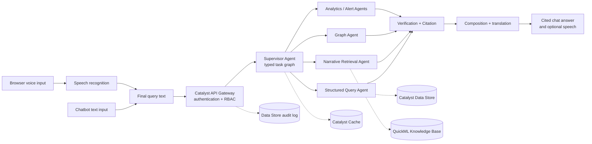

# KSP Crime Copilot

Conversational intelligence for the Karnataka State Police crime database. The project combines secure natural-language querying, Kannada-English language support, explainable citations, rank-derived access control, and a Catalyst-native multi-agent architecture for crime analysis.

> **Project:** KSP Datathon 2026, Challenge 01  
> **Platform:** Zoho Catalyst  
> **Data:** Official relational schema with deterministic synthetic rows for development and evaluation

## Overview

KSP Crime Copilot helps police personnel query structured CCTNS-style crime data using a chatbot or speech. It is designed for Kannada-first interaction with an English reasoning pivot, while preserving crime numbers, names, dates, and locations exactly for reliable citations.

The system is deliberately evidence-led:

- Structured questions use validated natural-language-to-SQL.
- Narrative questions use `CaseMaster.BriefFacts` retrieval.
- Link and pattern questions use a derived relationship layer rather than an invented graph database.
- Every answer is scoped by the caller's rank and unit/district access.
- Every factual answer must cite accessible `CrimeNo` values or the applied filter.
- Sensitive caste and religion fields are masked server-side and never used for prediction or scoring.

## Current Status

The repository contains a working Python query backend, deterministic synthetic data generator, SQLite test path, Catalyst Advanced I/O entrypoint, SQL validation, RBAC, translation helpers, citation checks, and test/evaluation harnesses.

The broader product plan covers the Catalyst-hosted chatbot, browser voice interface, multi-agent supervisor, cross-lingual MO matching, derived graph visualization, and cross-jurisdiction silent-match alerts. These capabilities are specified in `PLAN.md` and the linked design/implementation documents; some remain deployment or frontend work rather than completed local modules.

Live Catalyst deployment has been exercised, but the end-to-end smoke tests still have a documented ZCQL foreign-key/`ROWID` integration gap. See [`docs/CATALYST_RUNBOOK.md`](docs/CATALYST_RUNBOOK.md) before treating the live path as fully closed.

## Main Capabilities

### Conversational query

- Chatbot text queries in English, Kannada, or mixed language.
- Speech queries using a provider-neutral voice architecture.
- Follow-up questions using Catalyst Cache session context.
- English-pivot reasoning with Kannada response rendering.
- SQL generation restricted to an allowlisted schema and safe functions.
- Evidence verification, refusal handling, and citation-preserving answers.
- PDF export of conversation history through SmartBrowz.

### Crime intelligence

- Crime counts, filters, dates, sections, stations, and case facts.
- Semantic retrieval over `BriefFacts`.
- Cross-lingual Kannada-English modus operandi matching.
- Derived person, case, section, employee, and proximity relationships.
- Network traversal, community/centrality analysis, and graph visualization.
- Trend analysis, geographic hotspots, and geographic early warnings.
- Cross-jurisdiction silent-match alerts with evidence scoring and deduplication.
- Cited behavioral and prevention briefings as decision support, never automatic risk scores.

### Governance and safety

- Rank-derived capabilities using `Rank.Hierarchy`.
- Unit and district scope from `Employee.UnitID` and `Employee.DistrictID`.
- Server-side masking for DPDP-sensitive demographic fields.
- Immutable audit records for questions, SQL, citations, refusals, and actions.
- No predictive use of caste or religion.
- No raw audio persistence by default in the voice design.

## Architecture



### Query flow

1. The officer submits a typed chatbot message or a final speech transcript.
2. Catalyst authenticates the caller and derives rank/unit/district scope.
3. Language is detected; Kannada or mixed-language text is normalized for reasoning while protected identifiers remain unchanged.
4. The Supervisor Agent creates a typed `TaskContext` and fans out only the relevant specialist tasks.
5. Specialists return typed `EvidenceBundle` objects containing claims, rows, citations, confidence, limitations, and model/index versions.
6. Verification checks authorization, conflicts, citations, and unsupported claims.
7. Composition renders the verified answer in the requested language.
8. The same `turn_id` is returned for voice requests so stale responses cannot be spoken after an interruption.

## Zoho Catalyst Services

| Catalyst service | Responsibility |
|---|---|
| Web Client Hosting | Chatbot, speech controls, citation panel, graph/map views, PDF download |
| Authentication | Login and authenticated caller identity |
| API Gateway | Authentication boundary, authorization hooks, throttling, audit hooks |
| Functions / Advanced I/O | Query handler, supervisor, specialist agents, validation, retries, evidence verification |
| Data Store | Official tables, derived edge tables, alerts, MO metadata, and audit log |
| Cache | Conversation context and active filters |
| QuickML LLM Serving | NL-to-SQL, answer composition, profiling, translation orchestration |
| QuickML Knowledge Base | Semantic retrieval over `BriefFacts` |
| QuickML Pipelines | DBSCAN hotspots, trends, anomaly/forecast processing |
| Zia | Language/OCR support and possible voice fallback where configured |
| SmartBrowz | Conversation-to-PDF export |
| Stratus | PDF and generated artifact storage |
| Cron / Circuits | Index refresh, graph rebuilds, batch alert scans, and durable long-running tasks |

## Data Model

The authoritative schema is [`Police_FIR_ER_Diagram.md`](Police_FIR_ER_Diagram.md). It is a 23-table relational CCTNS-style model centered on `CaseMaster`.

Important schema constraints:

- `CaseMaster.BriefFacts` is the primary free-text narrative field.
- `latitude` and `longitude` provide geographic data.
- There is no native cross-case person identifier.
- There are no phone, vehicle, address, or bank-account entities in the provided schema.
- Hidden relationships are derived during ingestion and stored in Catalyst Data Store tables such as `PersonNode`, `EdgePersonCase`, `EdgeCaseEmployee`, `EdgeCaseSection`, and `EdgeCaseNear`.
- Catalyst foreign-key columns use parent `ROWID` values in the live import path; see the remapping utility and runbook.

## Repository Layout

```text
functions/crime_query/       Catalyst Advanced I/O Python function
  main.py                    Request handler and query orchestration
  agent.py                   NL-to-SQL execution and answer verification
  catalog.py                 Schema catalog, DDL, identifying/sensitive columns
  db.py                      SQLite and Catalyst Data Store adapters
  llm.py                     QuickML LLM client
  prompt.py                  Schema-aware prompts and repair prompts
  rbac.py                    Rank, unit, district, masking, and scope rules
  translate.py               Kannada detection, translation, and token protection
  validate.py                SQL parsing and allowlist validation
tests/                       Offline pytest suite
tools/                       Synthetic data and Catalyst import/remapping tools
eval/                        Labelled questions and QuickML evaluation harness
docs/                        Runbook, DDL, specs, and implementation plans
PLAN.md                      Current architecture and execution plan
AGENTS.md                    Contributor and repository guidelines
Police_FIR_ER_Diagram.md     Authoritative provided schema
requirements.txt             Local development dependencies
```

## Prerequisites

- Python 3.9 or a compatible Python environment.
- `pip` and virtual-environment support.
- Zoho Catalyst CLI and an authenticated Catalyst project for live deployment.
- QuickML credentials for the live LLM evaluation path.

Local tests use SQLite and fakes; they do not require Catalyst credentials.

## Local Setup

```bash
python3 -m venv .venv
source .venv/bin/activate
python -m pip install -r requirements.txt
```

Run the offline test suite:

```bash
python -m pytest -q
```

Generate the deterministic SQLite database and CSV fixtures:

```bash
python -m tools.gen_data --sqlite build/crime.db --csv build/csv
```

The generator creates 5,000 synthetic cases and deliberately seeds patterns used by tests and demonstrations, including two-wheeler theft trends, a burglary cluster, and name variants such as `Ravi Kumar`, `Ravi K`, `R. Kumar`, and `Ravikumar`.

## Evaluation

The evaluation harness compares generated and gold SQL by executing both and comparing result sets. It reports accuracy, hallucination rate, and p95 latency.

Set the required QuickML environment variables and run:

```bash
export QUICKML_ENDPOINT="..."
export QUICKML_TOKEN="..."
export QUICKML_ORG_ID="..."
python -m eval.run_eval --sqlite build/crime.db --verbose
```

The current targets are at least 85% SQL correctness, approximately 0% hallucinated citation rate, and less than 8 seconds p95 latency. See [`eval/questions.yaml`](eval/questions.yaml) and [`eval/run_eval.py`](eval/run_eval.py).

## Catalyst Deployment

Deploy the query function after authenticating the Catalyst CLI and configuring the function environment:

```bash
catalyst deploy --only functions:crime_query
```

The function uses Python 3.9 and pins `zcatalyst-sdk==1.3.0` in [`functions/crime_query/requirements.txt`](functions/crime_query/requirements.txt). QuickML endpoint and organization settings are configured through [`functions/crime_query/catalyst-config.json`](functions/crime_query/catalyst-config.json); do not commit tokens or API keys.

For table creation, CSV import, Catalyst foreign-key remapping, smoke tests, known deployment behavior, and the current live blocker, follow [`docs/CATALYST_RUNBOOK.md`](docs/CATALYST_RUNBOOK.md).

## Current Query Contract

The current Advanced I/O handler accepts JSON with a question and employee identity:

```json
{
  "employee_id": 9,
  "question": "How many two-wheeler thefts were reported in Bengaluru East?"
}
```

Responses include refusal status, answer text, generated SQL when safe, rows, citations, filter citations, hallucinated crime numbers, and detected language. The planned chatbot and voice contract adds `session_id`, `turn_id`, `input_mode`, `language_segments`, and `response_language` while preserving the same query and authorization path.

## Security and Data Handling

- Never commit OAuth tokens, API keys, production exports, or real case data.
- Treat browser metadata and client-supplied employee identifiers as untrusted.
- Enforce rank and unit/district scope in the serving layer, not only in the UI.
- Preserve `CrimeNo` citations through translation and answer composition.
- Mask `CasteID` and `ReligionID` according to rank-derived policy.
- Do not use caste or religion as a predictive, graph, alert, or risk-scoring feature.
- Avoid raw-audio persistence by default and define transcript retention before production voice deployment.
- Log refusals, access decisions, SQL metadata, citations, and actions for auditability.

## Documentation Map

- [`PLAN.md`](PLAN.md): current architecture, Catalyst service map, multi-agent execution plan, capabilities, risks, demo, and definition of done.
- [`docs/CATALYST_RUNBOOK.md`](docs/CATALYST_RUNBOOK.md): live Catalyst setup, imports, deployment, smoke tests, and known gaps.
- [`docs/schema-ddl.sql`](docs/schema-ddl.sql): local SQLite/Catalyst-oriented DDL.
- [`docs/superpowers/specs/2026-07-22-voice-interaction-architecture-design.md`](docs/superpowers/specs/2026-07-22-voice-interaction-architecture-design.md): provider-neutral chatbot/voice architecture, turn cancellation, stale-response protection, and rollout.
- [`docs/superpowers/specs/2026-07-21-cross-lingual-semantic-mo-matching-design.md`](docs/superpowers/specs/2026-07-21-cross-lingual-semantic-mo-matching-design.md): Kannada-English MO matching.
- [`docs/superpowers/specs/2026-07-18-cross-jurisdiction-silent-match-alerts-design.md`](docs/superpowers/specs/2026-07-18-cross-jurisdiction-silent-match-alerts-design.md): proactive cross-jurisdiction alerts.
- [`docs/superpowers/specs/2026-07-21-rank-derived-capability-rbac-design.md`](docs/superpowers/specs/2026-07-21-rank-derived-capability-rbac-design.md): rank-derived authorization and field masking.
- [`docs/superpowers/plans/2026-07-21-cross-lingual-silent-match-alerts.md`](docs/superpowers/plans/2026-07-21-cross-lingual-silent-match-alerts.md): implementation plan for MO matching and alerts.
- [`docs/superpowers/plans/2026-07-21-rank-derived-capability-rbac.md`](docs/superpowers/plans/2026-07-21-rank-derived-capability-rbac.md): implementation plan for RBAC.
- [`AGENTS.md`](AGENTS.md): contributor workflow, coding style, testing, commits, and security rules.

## Contributing

1. Read [`AGENTS.md`](AGENTS.md), [`PLAN.md`](PLAN.md), and the authoritative schema before changing code or architecture.
2. Keep Catalyst as the mandated deployment platform and use existing repository patterns.
3. Add focused pytest coverage for every behavior change.
4. Run `python -m pytest -q` and `git diff --check` before submitting.
5. Use concise imperative conventional commits such as `feat:`, `fix:`, `docs:`, or `validate:`.
6. Describe schema impact, test results, live Catalyst verification, and security implications in pull requests.

## Contributors

Contributors are listed from the repository's Git history and the project team list:

- **SHYAMSUNDAR2396**
- **jeevanav123**
- [**JheevikhaKannadasan**](https://github.com/JheevikhaKannadasan)
- [**G Thiruvarasmurthy**](https://github.com/Thiruvarasamurthy)
- **PK LATHISS KHUMAR**

GitHub links are included where they were provided by the project team.

## License

No license file is currently declared in this repository. Confirm the intended license and data-use terms before distributing the project or deploying it with non-synthetic case data.
